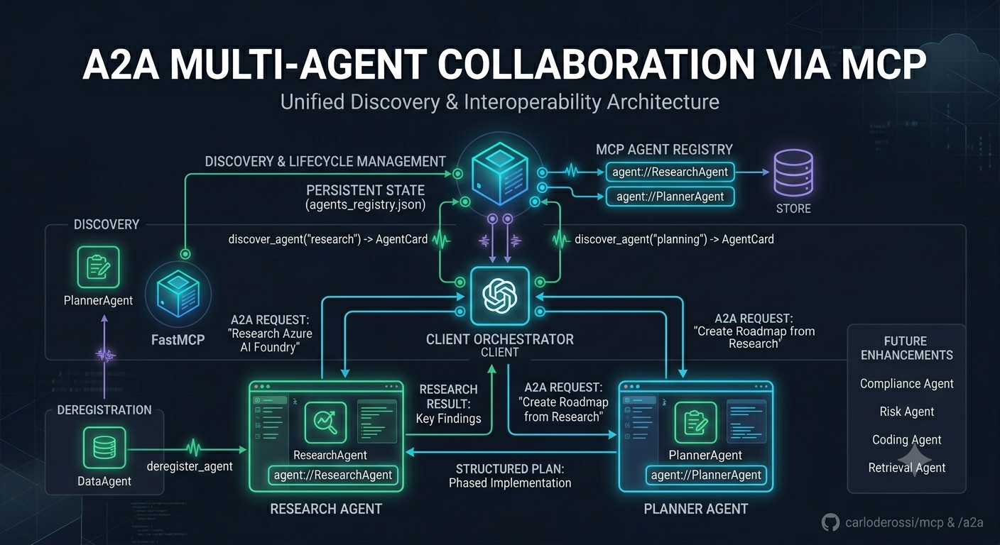

# Multi-Agent Collaboration using MCP Registry and A2A

## Overview

This example demonstrates how a dynamic MCP Agent Registry can be combined with the Agent-to-Agent (A2A) protocol to build discoverable multi-agent systems.

The MCP Registry acts as a centralized discovery service, while A2A provides the communication protocol between agents.

MCP Registry  →  Agent Discovery
A2A Protocol  →  Agent Communication

```text
Research Agent
      │
      ▼
Planner Agent
      │
      ▼
Client Orchestrator

All agents registered dynamically in the MCP Registry
and discovered through AgentCards.
```

### Responsibilities

| Component      | Responsibility                          |
| -------------- | --------------------------------------- |
| MCP Registry   | Agent registration and discovery        |
| AgentCard      | Agent metadata and capabilities         |
| A2A Protocol   | Agent-to-agent communication            |
| Research Agent | Information gathering and summarization |
| Planner Agent  | Strategy and plan generation            |
| Client Agent   | Workflow orchestration                  |

---

## Architecture

```text
+------------------------------------------------+
|                MCP Agent Registry              |
+------------------------------------------------+
| agent://ResearchAgent                          |
| agent://PlannerAgent                           |
+----------------------+-------------------------+
                       |
                       | discover
                       v

               +---------------+
               | Client Agent  |
               +-------+-------+
                       |
         +-------------+-------------+
         |                           |
         v                           v

+----------------+       +----------------+
| Research Agent | ----> | Planner Agent  |
+----------------+       +----------------+
        A2A                A2A
```

---

## Workflow

### Step 1 – Agent Registration

Agents register themselves in the MCP Registry.

```python
register_agent(research_agent_card)
register_agent(planner_agent_card)
```

The registry stores the AgentCards and exposes them as MCP Resources.

```text
agent://ResearchAgent
agent://PlannerAgent
```

---

### Step 2 – Agent Discovery

The Client Agent queries the MCP Registry.

```python
resources = mcp_client.list_resources()
```

Result:

```text
agent://ResearchAgent
agent://PlannerAgent
```

The Client Agent retrieves each AgentCard.

```python
research_card = mcp_client.read_resource(
    "agent://ResearchAgent"
)

planner_card = mcp_client.read_resource(
    "agent://PlannerAgent"
)
```

---

### Step 3 – A2A Communication

The Client Agent uses the URLs contained in the AgentCards.

Research Agent Card:

```json
{
  "name": "Research Agent",
  "url": "http://localhost:9001",
  "skills": [
    {
      "id": "research"
    }
  ]
}
```

Planner Agent Card:

```json
{
  "name": "Planner Agent",
  "url": "http://localhost:9002",
  "skills": [
    {
      "id": "planning"
    }
  ]
}
```

---

### Step 4 – Research

Client sends a query to the Research Agent.

```text
Research the advantages of Azure AI Foundry
for enterprise AI development.
```

Research Agent returns:

```text
Azure AI Foundry provides:

- Model catalog
- Prompt flow
- Evaluation pipelines
- Safety tooling
- Enterprise governance
```

---

### Step 5 – Planning

The Client Agent forwards the research output to the Planner Agent.

```text
Create an implementation roadmap based on
the following research findings...
```

Planner Agent returns:

```text
Phase 1:
- Environment setup

Phase 2:
- Model evaluation

Phase 3:
- Production deployment

Phase 4:
- Monitoring and governance
```

---

## End-to-End Sequence Diagram

```text
Research Agent registers
        │
        ▼
MCP Registry

Planner Agent registers
        │
        ▼
MCP Registry

Client Agent
        │
        ├─ List Resources
        ▼
MCP Registry

agent://ResearchAgent
agent://PlannerAgent

        │
        ├─ Read AgentCards
        ▼

Research Agent URL
Planner Agent URL

        │
        ├─ A2A Request
        ▼

Research Agent

        │
        ├─ Research Result
        ▼

Client Agent

        │
        ├─ A2A Request
        ▼

Planner Agent

        │
        └─ Structured Plan
```

---

## Benefits of MCP + A2A

### Dynamic Discovery

Agents do not require hardcoded URLs.

### Loose Coupling

Agents can be replaced without changing orchestration code.

### Capability-Based Routing

Clients can discover agents by skill.

```python
registry.find_by_skill("research")
registry.find_by_skill("planning")
```

### Enterprise Scalability

New agents can be added dynamically:

* Compliance Agent
* Risk Agent
* Coding Agent
* Evaluation Agent
* Retrieval Agent

without modifying existing workflows.

---

## Example Enterprise Scenario

```text
Customer Request
        │
        ▼

Research Agent
        │
        ▼

Compliance Agent
        │
        ▼

Risk Agent
        │
        ▼

Planner Agent
        │
        ▼

Final Recommendation
```

Each agent is discovered from the MCP Registry and communicates using the A2A protocol.

---

## Why This Architecture Matters

MCP and A2A solve different problems.

### MCP

Focuses on:

* Discovery
* Tooling
* Resources
* Context exchange

### A2A

Focuses on:

* Agent interoperability
* Task execution
* Multi-agent collaboration

Combining both creates a complete architecture for discoverable, interoperable, and scalable enterprise agent ecosystems.

For an AI Architect portfolio, this MCP Registry + A2A integration is the most compelling story across your repositories because it demonstrates three advanced concepts simultaneously:

1. **Agent discovery** (MCP Resources).
2. **Agent interoperability** (A2A AgentCards and protocol).
3. **Dynamic service registration** (runtime onboarding/offboarding of agents).

Those are exactly the patterns currently emerging in enterprise agent platforms and Azure AI Foundry ecosystems.
